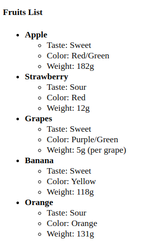

# LAB: w2_html_simple_web
In this lab, you will build a simple HTML page that lists various fruits, orders them by weigth, and displays a table with the fruit that has the highest and the lowest weight. Additionally, you will use other HTML elements such as headings, paragraphs, lists, links, images, and more. The aim is to learn the basics of HTML, understand how to structure content in HTML, and use different tags to build a web page.

Ps: Your index.html file should look like this in the browser. 

## Git Setup and Branching
Follow these steps to work with Git and complete the project:

🌟 Fork and Clone the Repository:🌟
1. Fork the repository on GitHub.

   

2. Then clone it to your local machine using the following command: 

    `git clone https://github.com/onja-org/w2_html_simple_web.git` 

🌟 Create a New Branch for Each Section: 🌟 
As you work through each task, create a new branch for each section of the project. This will help you keep your work organized and separate.
- Use the following command to create and switch to a new branch:

    `git checkout -b branch-name`

- Name your branch according to the section you’re working on. Use the following names for each section:
    - `header-section` – for the header section
    - `about-section` – for the about section
    - `list-section` – for the fruits list section
    - `footer-section` – for the footer section

🔷 For example, if you're working on the first task (header section), you would run:  

    git checkout -b header-section

🌟 Stage and Commit 🌟:  
After completing each section, you can stage and commit your changes using these git commands:

    git add .
    git commit -m "Completed Header section"

🌟 Push Your Changes to Github 🌟: 
Push your changes to the remote repository on GitHub:

    git push origin branch-name

🔷 Example:  `git push origin header-section`

🌟 Merge Your Branches into `publish` Branch.🌟: 
After finishing all sections and committing each branch, create a publish branch to merge all of your work using this command: `git checkout -b publish`

    🔸 Merge each individual branch into the `publish` branch

        git merge branch-name
        for example: git merge header-section
 

###  Resolve Any Merge Conflicts (if necessary): 
 Git will notify you of a conflict when you try to merge branches. Conflicted files will be marked in the terminal. Resolve them by editing the conflicting files: 
🔸 Open the file(s) that have conflicts. You’ll see sections like this:

🔸 Decide which code to keep. You can:

    - Keep your changes
    - OR Keep the other branch's changes
    - OR Combine both changes manually

🔸 Remove the conflict markers (<<<<<<<, =======, >>>>>>>). 

🔸 Stage and Commit: 
 After resolving the conflicts, stage and commit the changes:

    git add .
    git commit -m "Resolved merge conflicts"

### Push the publish branch:
Once all branches are merged, push the publish branch to your GitHub repository.

    git push origin publish

 

█▒▒▒▒▒▒▒▒▒ Note that the basic structure of an HTML document has already been set up for you. Your task is to place all of your content and code inside the `<body></body>` tag.

Ready to start 😊?

## Your Tasks:
### 1. Create the Header Section 
The header should includ the text

### 2. About section:
It should look like this:

👉 Use `href="https://www.healthline.com/nutrition/healthy-fruit` for the link 
👉 Use `./asset/fruit.jpg` for the image. 
👉 Use `<b>`, or `<strong>` for bolding texts, `<em>` and `i` for italic texts and `<u>` for underlined texts

### 3. Fruits list section
In this section you should have: 

#### a. Unordered List
- Give the list a heading `Fruit List` using `<h3>` tag.
- Create an unordered nested list to display a list of five fruits: Apple, Banana, Orange, Strawberry, and Grapes.
It should look like this: 

#### b. Ordered List
- Give the list a heading `Fruits Categorized by weight` using `<h3>` tag.
- Create a list of the fruits in order of their weight, from heaviest to lightest.

### 4. Table Section
Display the heaviest and lightest fruit in the table.

### 5. Footer Section
Finish with a footer thanking users for visiting.
The text is: 
 `"Thanks for visiting! Stay healthy and enjoy fruits!`

And that’s a wrap! Happy coding, and have fun building your project! 🚀

